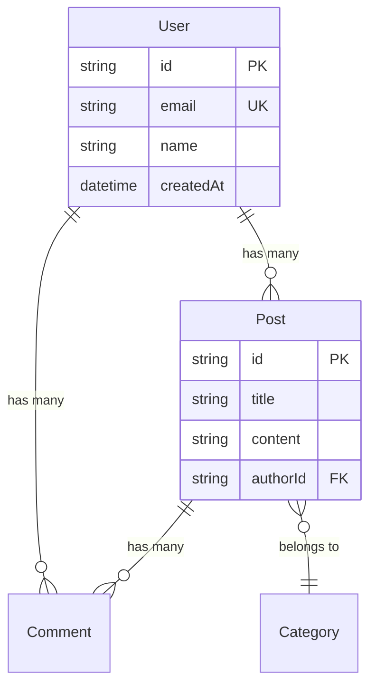

# schema_scanner

数据模型扫描 Skill - 从 ORM 定义中提取数据库 Schema

## 用途

扫描项目的 ORM Schema 定义，提取数据模型信息，返回结构化数据供文档生成使用。

## 输入

```yaml
input:
  project_path: string      # 项目根目录路径
  orm: string               # prisma | typeorm | sequelize | mongoose | drizzle（可选，自动检测）
  include_patterns: [string] # 包含的文件模式（可选）
```

## 输出

```yaml
output:
  success: boolean
  data:
    orm: string
    database_type: string     # postgresql | mysql | mongodb | sqlite
    total_models: number
    total_relations: number

    # 模型列表
    models:
      - name: string          # 模型名称（如 User）
        table_name: string    # 表名（如 users）
        file: string          # 源文件路径
        line: number          # 行号

        # 字段列表
        fields:
          - name: string      # 字段名
            type: string      # 类型（String, Int, DateTime...）
            db_type: string   # 数据库类型（VARCHAR, INTEGER...）
            nullable: boolean
            default: any      # 默认值
            primary_key: boolean
            unique: boolean
            auto_increment: boolean

            # 约束
            constraints:
              min: number
              max: number
              pattern: string
              enum: [string]

        # 关系
        relations:
          - name: string      # 关系字段名
            type: string      # one-to-one | one-to-many | many-to-one | many-to-many
            target: string    # 目标模型名
            foreign_key: string
            inverse: string   # 反向关系字段名

        # 索引
        indexes:
          - name: string
            fields: [string]
            type: string      # btree | hash | unique | fulltext
            unique: boolean

        # 置信度
        confidence: number
        confidence_reason: string

    # 关系图数据（用于生成 Mermaid）
    relations_graph:
      nodes: [{id: string, label: string}]
      edges: [{from: string, to: string, type: string, label: string}]

    # 数据库信息
    database_info:
      type: string            # postgresql | mysql | mongodb | sqlite
      provider: string        # ORM 名称
      connection_var: string  # 环境变量名（如 DATABASE_URL）

    # 扫描统计
    stats:
      files_scanned: number
      models_found: number
      relations_found: number
      indexes_found: number

  error: string | null
```

## ORM 检测规则

### Prisma

```
检测：
  - prisma/schema.prisma 存在
  - package.json 包含 @prisma/client

Schema 文件：
  prisma/schema.prisma

解析语法：
  model User {
    id        String   @id @default(cuid())
    email     String   @unique
    name      String?
    posts     Post[]
    createdAt DateTime @default(now())
  }
```

### TypeORM

```
检测：
  - package.json 包含 typeorm
  - src/entities/*.ts 存在

Entity 文件：
  src/entities/**/*.ts
  src/entity/**/*.ts

解析语法：
  @Entity()
  class User {
    @PrimaryGeneratedColumn()
    id: number

    @Column({ unique: true })
    email: string

    @OneToMany(() => Post, post => post.author)
    posts: Post[]
  }
```

### Sequelize

```
检测：
  - package.json 包含 sequelize
  - src/models/*.js 存在

Model 文件：
  src/models/**/*.{js,ts}
  models/**/*.{js,ts}

解析语法：
  User.init({
    email: {
      type: DataTypes.STRING,
      unique: true
    }
  }, { sequelize })
```

### Mongoose

```
检测：
  - package.json 包含 mongoose

Schema 文件：
  src/models/**/*.{js,ts}
  src/schemas/**/*.{js,ts}

解析语法：
  const userSchema = new Schema({
    email: { type: String, unique: true },
    name: String,
    posts: [{ type: Schema.Types.ObjectId, ref: 'Post' }]
  })
```

### Drizzle

```
检测：
  - package.json 包含 drizzle-orm

Schema 文件：
  src/db/schema.ts
  src/schema/**/*.ts
  drizzle/schema.ts

解析语法：
  export const users = pgTable('users', {
    id: serial('id').primaryKey(),
    email: varchar('email', { length: 255 }).unique(),
    name: text('name')
  })
```

## 字段类型映射

### Prisma → 通用类型

```yaml
String:     { type: "String", db_type: "VARCHAR" }
Int:        { type: "Int", db_type: "INTEGER" }
BigInt:     { type: "BigInt", db_type: "BIGINT" }
Float:      { type: "Float", db_type: "FLOAT" }
Decimal:    { type: "Decimal", db_type: "DECIMAL" }
Boolean:    { type: "Boolean", db_type: "BOOLEAN" }
DateTime:   { type: "DateTime", db_type: "TIMESTAMP" }
Json:       { type: "Json", db_type: "JSONB" }
Bytes:      { type: "Bytes", db_type: "BYTEA" }
```

### TypeORM → 通用类型

```yaml
varchar:    { type: "String", db_type: "VARCHAR" }
text:       { type: "String", db_type: "TEXT" }
int:        { type: "Int", db_type: "INTEGER" }
bigint:     { type: "BigInt", db_type: "BIGINT" }
float:      { type: "Float", db_type: "FLOAT" }
decimal:    { type: "Decimal", db_type: "DECIMAL" }
boolean:    { type: "Boolean", db_type: "BOOLEAN" }
timestamp:  { type: "DateTime", db_type: "TIMESTAMP" }
json:       { type: "Json", db_type: "JSON" }
uuid:       { type: "UUID", db_type: "UUID" }
```

## 关系类型识别

### Prisma

```prisma
// One-to-Many
model User {
  posts Post[]      // 一对多
}
model Post {
  author User @relation(fields: [authorId], references: [id])
  authorId String   // 外键
}

// Many-to-Many
model Post {
  tags Tag[]        // 多对多
}
model Tag {
  posts Post[]
}

// One-to-One
model User {
  profile Profile?  // 一对一
}
```

### TypeORM

```typescript
// One-to-Many
@OneToMany(() => Post, post => post.author)
posts: Post[]

// Many-to-One
@ManyToOne(() => User, user => user.posts)
author: User

// Many-to-Many
@ManyToMany(() => Tag)
@JoinTable()
tags: Tag[]

// One-to-One
@OneToOne(() => Profile)
@JoinColumn()
profile: Profile
```

## 索引识别

### Prisma

```prisma
model User {
  @@index([email])
  @@index([createdAt, status])
  @@unique([email, tenantId])
}
```

### TypeORM

```typescript
@Index(['email'])
@Index(['createdAt', 'status'])
@Unique(['email', 'tenantId'])
```

## 置信度计算

```yaml
confidence_rules:
  high (>= 0.8):
    - Prisma schema（语法明确）
    - TypeORM 装饰器完整
    - 有明确的类型定义

  medium (0.5 - 0.8):
    - Sequelize/Mongoose 模型
    - 部分类型信息缺失
    - 动态定义的字段

  low (< 0.5):
    - 无类型 JavaScript
    - 动态 Schema
    - 无法解析的语法
```

## 扫描流程

```
1. 检测 ORM 类型
   ├─ 检查配置文件
   └─ 或使用传入的 orm 参数

2. 定位 Schema 文件
   ├─ 根据 ORM 类型确定搜索模式
   └─ 应用 include patterns

3. 解析每个文件
   ├─ 提取模型定义
   ├─ 提取字段信息
   ├─ 提取约束和默认值
   └─ 记录文件和行号

4. 解析关系
   ├─ 识别关系类型
   ├─ 提取外键信息
   └─ 建立模型间连接

5. 提取索引
   ├─ 普通索引
   ├─ 唯一索引
   └─ 复合索引

6. 生成关系图数据
   ├─ 构建节点列表
   └─ 构建边列表

7. 计算置信度
   └─ 根据信息完整度打分
```

## 使用示例

### 示例 1：Prisma 项目

```yaml
input:
  project_path: "./backend"
  orm: "prisma"

output:
  success: true
  data:
    orm: "prisma"
    database_type: "postgresql"
    total_models: 5
    total_relations: 8

    models:
      - name: "User"
        table_name: "users"
        file: "prisma/schema.prisma"
        line: 10
        fields:
          - name: "id"
            type: "String"
            db_type: "VARCHAR"
            nullable: false
            primary_key: true
            default: "cuid()"
          - name: "email"
            type: "String"
            db_type: "VARCHAR"
            nullable: false
            unique: true
          - name: "name"
            type: "String"
            db_type: "VARCHAR"
            nullable: true
          - name: "createdAt"
            type: "DateTime"
            db_type: "TIMESTAMP"
            nullable: false
            default: "now()"
        relations:
          - name: "posts"
            type: "one-to-many"
            target: "Post"
            inverse: "author"
          - name: "comments"
            type: "one-to-many"
            target: "Comment"
            inverse: "author"
        indexes:
          - fields: ["email"]
            unique: true
          - fields: ["createdAt"]
            type: "btree"
        confidence: 0.95
        confidence_reason: "Prisma schema 语法明确"

    relations_graph:
      nodes:
        - { id: "User", label: "User" }
        - { id: "Post", label: "Post" }
        - { id: "Comment", label: "Comment" }
      edges:
        - { from: "User", to: "Post", type: "one-to-many", label: "posts" }
        - { from: "User", to: "Comment", type: "one-to-many", label: "comments" }
        - { from: "Post", to: "Comment", type: "one-to-many", label: "comments" }

    database_info:
      type: "postgresql"
      provider: "prisma"
      connection_var: "DATABASE_URL"

    stats:
      files_scanned: 1
      models_found: 5
      relations_found: 8
      indexes_found: 6
```

### 示例 2：Mongoose 项目

```yaml
input:
  project_path: "./backend"
  orm: "mongoose"

output:
  success: true
  data:
    orm: "mongoose"
    database_type: "mongodb"
    total_models: 3
    models:
      - name: "User"
        table_name: "users"  # collection name
        file: "src/models/User.ts"
        line: 5
        fields:
          - name: "email"
            type: "String"
            db_type: "String"
            unique: true
          - name: "posts"
            type: "ObjectId[]"
            db_type: "ObjectId"
            # ref 关系
        relations:
          - name: "posts"
            type: "one-to-many"
            target: "Post"
        confidence: 0.7
        confidence_reason: "Mongoose Schema，部分类型需推断"
```

## 生成 Mermaid ER 图

基于 `relations_graph` 数据可生成：



## 错误处理

```yaml
# 无法识别 ORM
output:
  success: false
  error: "Cannot detect ORM. Please specify --orm parameter"

# Schema 文件不存在
output:
  success: true
  data:
    orm: "prisma"
    total_models: 0
    models: []
  warning: "prisma/schema.prisma not found"

# 解析部分失败
output:
  success: true
  data:
    # ... 正常数据
  warnings:
    - "Failed to parse src/models/legacy.ts: Syntax error"
```

## 限制和说明

1. **静态分析**：只分析静态定义的 Schema
2. **动态 Schema**：Mongoose 动态字段可能遗漏
3. **迁移历史**：不分析数据库迁移历史
4. **视图/存储过程**：不扫描数据库视图和存储过程

## 关联 Skills

- `tech_stack_detector` - 检测 ORM 类型
- `api_scanner` - 扫描相关的 API 端点
