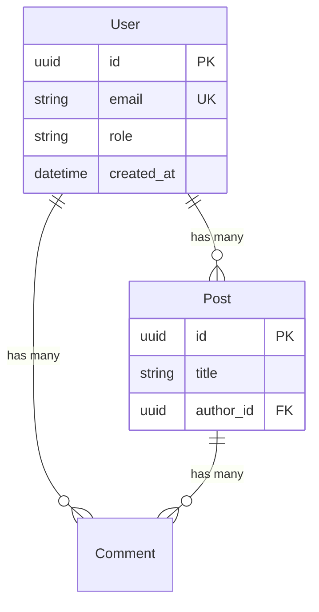

# schema_scanner

数据模型扫描 Skill - 从 ORM/Schema 定义中提取数据结构

## 用途

扫描项目的数据模型定义，提取数据库 Schema 信息，返回结构化数据。

## 输入契约

```yaml
input:
  project_path: string        # 项目根目录路径
  include_patterns: [string]  # 可选：包含的文件模式
```

## 输出契约

```yaml
output:
  success: boolean
  data:
    # 检测到的 ORM/Schema 工具
    orm: string               # sqlalchemy | prisma | typeorm | django-orm | mongoose | drizzle | ...
    language: string          # python | typescript | javascript | go | ...
    database_type: string     # postgresql | mysql | mongodb | sqlite | ...

    total_models: number
    total_relations: number

    # 模型列表
    models:
      - name: string          # 模型/实体名称（如 User）
        table_name: string    # 表名（如 users）
        file: string          # 源文件路径
        line: number          # 行号

        # 字段列表
        fields:
          - name: string      # 字段名
            type: string      # 应用层类型（String, Int, DateTime, UUID...）
            db_type: string | null  # 数据库类型（VARCHAR, INTEGER...）
            nullable: boolean
            default: any | null
            primary_key: boolean
            unique: boolean
            auto_increment: boolean
            foreign_key: string | null  # 引用的表.字段

            # 约束（如果能提取）
            constraints:
              min: number | null
              max: number | null
              pattern: string | null
              enum: [string] | null

        # 关系
        relations:
          - name: string      # 关系字段名
            type: string      # one-to-one | one-to-many | many-to-one | many-to-many
            target: string    # 目标模型名
            foreign_key: string | null
            inverse: string | null  # 反向关系字段名

        # 索引
        indexes:
          - name: string | null
            fields: [string]
            type: string      # btree | hash | unique | fulltext | gin | gist | ...
            unique: boolean

        # 置信度
        confidence: number
        confidence_reason: string

    # 关系图数据（用于生成 ER 图）
    relations_graph:
      nodes:
        - id: string
          label: string
      edges:
        - from: string
          to: string
          type: string
          label: string

    # 数据库信息
    database_info:
      type: string
      provider: string
      connection_var: string | null  # 环境变量名
      extensions: [string]           # 使用的扩展（如 pgvector, uuid-ossp）

    # 扫描统计
    stats:
      files_scanned: number
      models_found: number
      relations_found: number
      indexes_found: number
      by_field_type:
        - type: string
          count: number

  error: string | null
```

## 能力边界

### 能做
- 从 ORM 模型定义提取表结构
- 识别字段类型、约束、默认值
- 提取关系（一对一、一对多、多对多）
- 识别索引定义
- 生成关系图数据

### 不能做
- 连接实际数据库
- 执行迁移或查询
- 分析数据内容
- 解析动态生成的 Schema

## 执行流程

```
1. 检测 ORM 类型
   └─ 从配置文件或导入语句推断

2. 定位 Schema 文件
   └─ 查找 models/, entities/, schema/ 等目录

3. 解析每个模型
   └─ 提取类/表定义
   └─ 提取字段和类型
   └─ 提取约束和默认值

4. 解析关系
   └─ 识别外键引用
   └─ 确定关系类型
   └─ 建立双向连接

5. 提取索引
   └─ 普通索引、唯一索引、复合索引

6. 生成关系图
   └─ 构建节点和边
```

## 使用示例

```yaml
# SQLAlchemy 项目示例
output:
  success: true
  data:
    orm: "sqlalchemy"
    language: "python"
    database_type: "postgresql"
    total_models: 5
    total_relations: 8

    models:
      - name: "User"
        table_name: "users"
        file: "app/models/user.py"
        line: 15
        fields:
          - name: "id"
            type: "UUID"
            db_type: "UUID"
            primary_key: true
          - name: "email"
            type: "String"
            db_type: "VARCHAR(255)"
            nullable: false
            unique: true
          - name: "role"
            type: "String"
            db_type: "VARCHAR(20)"
            nullable: false
            default: "user"
            constraints:
              enum: ["user", "admin", "super_admin"]
        relations:
          - name: "posts"
            type: "one-to-many"
            target: "Post"
            inverse: "author"
        indexes:
          - fields: ["email"]
            unique: true
        confidence: 0.95

    database_info:
      type: "postgresql"
      provider: "sqlalchemy"
      connection_var: "DATABASE_URL"
      extensions: ["pgvector", "uuid-ossp"]

# Prisma 项目示例
output:
  success: true
  data:
    orm: "prisma"
    language: "typescript"
    database_type: "postgresql"
    total_models: 4

    models:
      - name: "User"
        table_name: "users"
        file: "prisma/schema.prisma"
        line: 10
        fields:
          - name: "id"
            type: "String"
            db_type: "CUID"
            primary_key: true
            default: "cuid()"
          - name: "email"
            type: "String"
            unique: true
          - name: "createdAt"
            type: "DateTime"
            default: "now()"
        confidence: 0.98
        confidence_reason: "Prisma schema 语法明确"
```

## Mermaid ER 图生成

基于 `relations_graph` 可生成：



## 置信度规则

```yaml
high (>= 0.8):
  - 强类型 ORM（Prisma, SQLAlchemy 2.x, TypeORM）
  - 有完整类型注解
  - Schema 语法明确

medium (0.5 - 0.8):
  - 弱类型定义（Mongoose, Sequelize JS）
  - 部分类型信息缺失
  - 动态字段

low (< 0.5):
  - 纯 JavaScript 无类型
  - 运行时动态 Schema
  - 无法解析的语法
```

## 错误处理

```yaml
# 无法识别 ORM
output:
  success: false
  error: "Cannot detect ORM or database schema definitions"

# Schema 文件不存在
output:
  success: true
  data:
    orm: "prisma"
    total_models: 0
    models: []
  warning: "prisma/schema.prisma not found"
```
