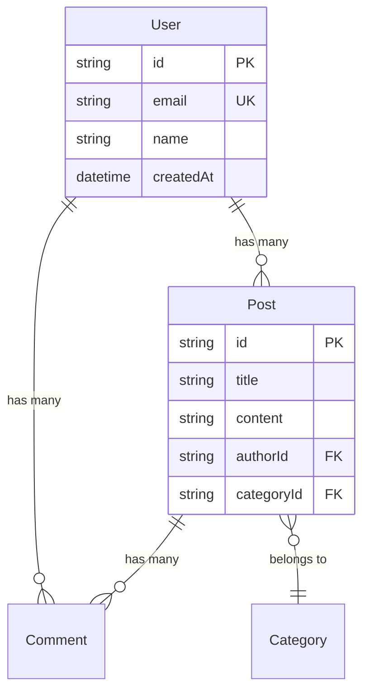

# /reverse-schema - 从代码逆向生成数据模型文档

你是一个 AI 协作开发助手。用户请求从现有代码逆向生成数据模型文档。

## 参数

- `$ARGUMENTS`：项目路径和选项
  - `--output=PATH`：输出路径（默认 docs/{project}/_foundation/03_DATA_MODEL.md）
  - `--orm=NAME`：指定 ORM（自动检测或手动指定）
  - `--include-relations`：包含关系图（默认开启）

## 用法

```
/reverse-schema ./my-backend
/reverse-schema ./my-backend --orm=prisma
/reverse-schema ./my-backend --output=./docs/schema.md
```

## 支持的数据源

| 类型 | 检测方式 | 支持程度 |
|------|----------|----------|
| Prisma | `prisma/schema.prisma` | ✅ 完整 |
| TypeORM | `src/entities/*.ts` | ✅ 完整 |
| Sequelize | `src/models/*.js` | ⚠️ 基础 |
| Mongoose | `src/models/*.ts` (Schema) | ⚠️ 基础 |
| Drizzle | `src/db/schema.ts` | ⚠️ 基础 |
| SQL 文件 | `*.sql`, `migrations/*.sql` | ⚠️ 基础 |

## 执行步骤

### 1. 检测数据源类型

```
按优先级检测：

1. Prisma：
   检查 prisma/schema.prisma 是否存在

2. TypeORM：
   检查 package.json 是否包含 typeorm
   查找 src/entities/*.ts

3. Sequelize：
   检查 package.json 是否包含 sequelize
   查找 src/models/*.js

4. Mongoose：
   检查 package.json 是否包含 mongoose
   查找包含 Schema 定义的文件

5. SQL 文件：
   查找 *.sql 或 migrations/*.sql
```

### 2. 解析 Schema 定义

#### Prisma

```
解析 prisma/schema.prisma：

model:
  name: "User"
  fields:
    - name: "id"
      type: "String"
      attributes: ["@id", "@default(cuid())"]
    - name: "email"
      type: "String"
      attributes: ["@unique"]
    - name: "posts"
      type: "Post[]"
      relation: true

relations:
  - from: "User"
    to: "Post"
    type: "one-to-many"
    field: "posts"
```

#### TypeORM

```
解析 @Entity 装饰器：

entity:
  name: "User"
  table: "users"
  columns:
    - name: "id"
      type: "uuid"
      primary: true
    - name: "email"
      type: "varchar"
      unique: true
  relations:
    - type: "OneToMany"
      target: "Post"
      property: "posts"
```

### 3. 生成数据模型文档

```markdown
# 03_DATA_MODEL.md
# {project_name} - 数据模型 [逆向]

> 版本：v0.1
> 生成时间：{datetime}
> 生成方式：/reverse-schema
> 数据源：{orm_type}
> 状态：待验证

---

## 概述

本文档由 `/reverse-schema` 命令自动生成。
内容标记为 [逆向]，请人工验证后更新状态。

**统计**：
- 模型/表数量：{total_models}
- 关系数量：{total_relations}
- 已验证：0

---

## 模型列表

| 模型 | 表名 | 字段数 | 关系 | 验证状态 |
|------|------|--------|------|----------|
| User | users | 8 | 3 | 待验证 |
| Post | posts | 6 | 2 | 待验证 |
{...}

---

## 实体关系图 [逆向]



---

## 详细定义

### User [逆向]

用户表

**来源**：`prisma/schema.prisma:10` 或 `src/entities/User.ts`

| 字段 | 类型 | 约束 | 说明 |
|------|------|------|------|
| id | String | PK, cuid | 主键 |
| email | String | Unique | 邮箱 |
| name | String | - | 用户名 |
| password | String | - | 密码（哈希） |
| createdAt | DateTime | Default(now) | 创建时间 |
| updatedAt | DateTime | @updatedAt | 更新时间 |

**关系**：
| 关系类型 | 目标模型 | 字段 | 说明 |
|----------|----------|------|------|
| OneToMany | Post | posts | 用户的文章 |
| OneToMany | Comment | comments | 用户的评论 |

**索引**：
- `email` (unique)
- `createdAt` (btree)

---

### Post [逆向]

文章表

**来源**：`prisma/schema.prisma:25`

| 字段 | 类型 | 约束 | 说明 |
|------|------|------|------|
| id | String | PK, cuid | 主键 |
| title | String | - | 标题 |
| content | String | - | 内容 |
| published | Boolean | Default(false) | 是否发布 |
| authorId | String | FK -> User.id | 作者 ID |
| categoryId | String? | FK -> Category.id | 分类 ID（可选） |

**关系**：
| 关系类型 | 目标模型 | 字段 |
|----------|----------|------|
| ManyToOne | User | author |
| ManyToOne | Category | category |
| OneToMany | Comment | comments |

---

{继续列出其他模型...}

---

## 验证清单

以下模型需要人工验证：

- [ ] User - 字段类型和约束
- [ ] Post - 关系定义
- [ ] Comment - 业务语义
- [ ] Category - 是否完整

---

## 数据库信息 [逆向]

```yaml
database:
  type: postgresql  # 从 datasource 推断
  provider: prisma

migrations:
  - 20240101_init
  - 20240115_add_category
  - 20240201_add_indexes
```

---

## 元数据

```yaml
_meta:
  generated_at: "{datetime}"
  generator: "/reverse-schema"
  source:
    type: "prisma"
    file: "prisma/schema.prisma"
  models_count: {N}
  relations_count: {N}
  confidence: 0.9  # Prisma 通常置信度高
```

---

_Generated by /reverse-schema | {datetime}_
```

### 4. 输出结果

```
✅ 数据模型文档生成完成！

项目：{project_name}
数据源：{orm_type}
输出：{output_path}

━━━━━━━━━━━━━━━━━━━━━━━━━━━━━━━━━━━━━━━━━━━━━━

📊 生成统计：
  模型数量：{models}
  关系数量：{relations}
  字段总数：{fields}
  置信度：{confidence}

📁 分析的文件：
  {列出分析的 schema 文件}

━━━━━━━━━━━━━━━━━━━━━━━━━━━━━━━━━━━━━━━━━━━━━━

⚠️ 重要提示：

  所有生成的内容标记为 [逆向]
  请人工验证后更新验证状态

  特别注意：
  - 检查字段的业务语义是否正确
  - 确认关系类型是否准确
  - 补充缺失的字段说明

📝 下一步操作：
  1. 查看生成的文档：{output_path}
  2. 验证模型定义是否准确
  3. 补充业务语义说明
  4. 更新验证状态

━━━━━━━━━━━━━━━━━━━━━━━━━━━━━━━━━━━━━━━━━━━━━━
```

## 置信度说明

```
Prisma: 0.9+（Schema 定义明确）
TypeORM: 0.8+（装饰器明确）
Sequelize: 0.6-0.8（需推断）
Mongoose: 0.6-0.8（Schema 灵活）
SQL 文件: 0.5-0.7（可能不完整）
```

## 错误处理

```
如果没有找到数据源：
  ❌ 未找到数据模型定义

  已搜索的位置：
  - prisma/schema.prisma
  - src/entities/
  - src/models/
  - *.sql

  建议：
  1. 确认项目包含数据模型
  2. 使用 --orm 指定类型
  3. 手动创建 03_DATA_MODEL.md

如果解析失败：
  ⚠️ Schema 解析不完整

  成功解析：{N} 个模型
  解析失败：{M} 个

  建议人工检查失败的模型
```

## 注意事项

1. **只读操作**：不会修改源代码或数据库
2. **[逆向] 标记**：所有生成内容需人工验证
3. **敏感信息**：不会读取数据库凭据
4. **Mermaid 图**：需要支持 Mermaid 的渲染器查看

## 关联命令

- `/scan-project` - 项目扫描
- `/integrate-project` - 项目整合
- `/reverse-api` - API 逆向生成
- `/sync-docs` - 检查文档与代码一致性
