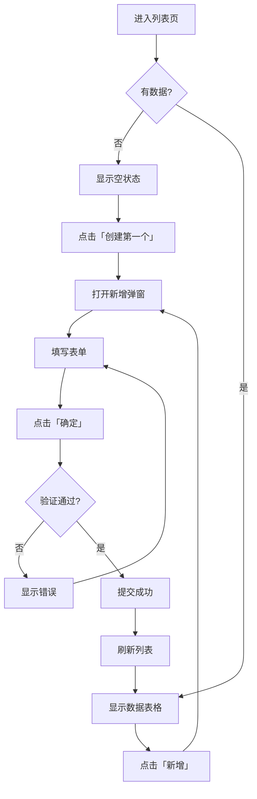

# UI_FLOW_SPEC_TEMPLATE.md
# UI 流程规格文档模板

---

> **使用说明**
> 1. 复制此模板到功能目录，重命名为 `11_UI_FLOW_SPEC.md`
> 2. 替换 `{placeholder}` 为实际内容
> 3. 根据功能复杂度增删页面和组件
> 4. 删除本使用说明块

---

# 11_UI_FLOW_SPEC.md
# {功能名称} - UI 流程规格

> 版本：v1.0
> 最后更新：{YYYY-MM-DD}
> 状态：{Draft | Review | Approved}
> 设计者：{@username}
> 关联文档：`00_CONTEXT.md`

---

## 1. 概述

### 1.1 功能简介

{简述本功能的 UI 部分要实现什么}

### 1.2 用户故事

```
作为 {角色}
我想要 {操作}
以便 {目的}
```

### 1.3 页面清单

| 页面 | 路由 | 描述 |
|------|------|------|
| {页面名称} | `/path/to/page` | {简要描述} |
| {页面名称} | `/path/to/page/:id` | {简要描述} |

---

## 2. 页面设计

### 2.1 {页面名称}

#### 基本信息

| 属性 | 值 |
|------|-----|
| 路由 | `/path/to/page` |
| 布局 | {全宽 / 居中 / 侧边栏} |
| 权限 | {需要登录 / 公开} |

#### 页面结构

```
┌─────────────────────────────────────────────────┐
│                    页面头部                       │
│  ┌─────────────────────────────────────────────┐│
│  │ 标题                         │ 操作按钮区    ││
│  └─────────────────────────────────────────────┘│
├─────────────────────────────────────────────────┤
│                    搜索区域                       │
│  ┌─────────────────────────────────────────────┐│
│  │ 搜索表单                                     ││
│  └─────────────────────────────────────────────┘│
├─────────────────────────────────────────────────┤
│                    数据区域                       │
│  ┌─────────────────────────────────────────────┐│
│  │ 数据表格 / 卡片列表                          ││
│  └─────────────────────────────────────────────┘│
│  ┌─────────────────────────────────────────────┐│
│  │ 分页                                         ││
│  └─────────────────────────────────────────────┘│
└─────────────────────────────────────────────────┘
```

#### 组件清单

| 组件 | Element Plus 组件 | 说明 |
|------|-------------------|------|
| 页面标题 | - | 文字 + 描述 |
| 新增按钮 | el-button (primary) | 打开新增弹窗 |
| 搜索表单 | el-form (inline) | 关键词 + 状态筛选 |
| 数据表格 | el-table | 显示数据列表 |
| 分页 | el-pagination | 分页控制 |

#### 交互说明

| 操作 | 触发 | 响应 |
|------|------|------|
| 点击「新增」 | Button click | 打开新增弹窗 |
| 输入搜索关键词 | Input change + 防抖 | 刷新列表 |
| 点击「编辑」 | Table row action | 打开编辑弹窗 |
| 点击「删除」 | Table row action | 显示确认框 → 删除 |
| 切换分页 | Pagination change | 刷新列表 |

#### 状态处理

| 状态 | UI 表现 |
|------|---------|
| 加载中 | el-table 显示 loading |
| 空数据 | el-empty 显示「暂无数据」|
| 搜索无结果 | el-empty 显示「未找到匹配结果」|
| 加载失败 | el-result 显示错误信息 + 重试按钮 |

---

### 2.2 {页面名称 - 详情页}

#### 基本信息

| 属性 | 值 |
|------|-----|
| 路由 | `/path/to/page/:id` |
| 布局 | 居中（max-width: 900px）|
| 权限 | 需要登录 |

#### 页面结构

```
┌─────────────────────────────────────────────────┐
│  ← 返回列表                                      │
├─────────────────────────────────────────────────┤
│                    页面头部                       │
│  ┌─────────────────────────────────────────────┐│
│  │ 标题            状态标签    │ 编辑 │ 删除   ││
│  └─────────────────────────────────────────────┘│
├─────────────────────────────────────────────────┤
│                    基本信息卡片                    │
│  ┌─────────────────────────────────────────────┐│
│  │ el-descriptions                              ││
│  └─────────────────────────────────────────────┘│
├─────────────────────────────────────────────────┤
│                    关联数据卡片                    │
│  ┌─────────────────────────────────────────────┐│
│  │ el-table / el-timeline                       ││
│  └─────────────────────────────────────────────┘│
└─────────────────────────────────────────────────┘
```

---

## 3. 弹窗/抽屉设计

### 3.1 {弹窗名称 - 新增/编辑}

#### 基本信息

| 属性 | 值 |
|------|-----|
| 类型 | Dialog |
| 宽度 | 600px |
| 关闭方式 | 按钮 / ESC / 点击遮罩（禁用）|

#### 表单字段

| 字段 | 组件 | 必填 | 验证规则 |
|------|------|------|----------|
| 名称 | el-input | 是 | 2-50 字符 |
| 描述 | el-input (textarea) | 否 | 最多 500 字符 |
| 类型 | el-select | 是 | 必选 |
| 状态 | el-switch | 否 | - |
| 图片 | el-upload | 否 | JPG/PNG，最大 2MB |

#### 表单布局

```
┌─────────────────────────────────────────────────┐
│  新增{对象}                              [X]     │
├─────────────────────────────────────────────────┤
│                                                  │
│  名称 *     [________________________]           │
│                                                  │
│  描述       [________________________]           │
│             [________________________]           │
│             [________________________]           │
│                                                  │
│  类型 *     [请选择类型        ▼]               │
│                                                  │
│  状态       [○ 启用]                            │
│                                                  │
├─────────────────────────────────────────────────┤
│                        [取消]  [确定]            │
└─────────────────────────────────────────────────┘
```

#### 交互说明

| 操作 | 响应 |
|------|------|
| 点击「确定」| 验证表单 → 提交 → 成功提示 → 关闭弹窗 → 刷新列表 |
| 点击「取消」| 如有更改则确认 → 关闭弹窗 |
| 提交失败 | 显示错误信息，不关闭弹窗 |

---

## 4. 用户流程

### 4.1 {流程名称}



---

## 5. 边界条件

### 5.1 输入限制

| 字段 | 最小 | 最大 | 格式 |
|------|------|------|------|
| 名称 | 2 字符 | 50 字符 | 字母/数字/中文 |
| 描述 | - | 500 字符 | 任意文本 |
| 邮箱 | - | 255 字符 | 邮箱格式 |

### 5.2 特殊场景

| 场景 | 处理方式 |
|------|----------|
| 网络断开 | 显示错误提示，提供重试按钮 |
| 会话过期 | 跳转登录页 |
| 权限不足 | 显示 403 页面 |
| 数据不存在 | 显示 404 页面 |

---

## 6. 示例数据

### 6.1 列表数据

```json
{
  "data": [
    {
      "id": 1,
      "name": "示例名称",
      "status": "active",
      "createdAt": "2024-12-09T10:00:00Z"
    }
  ],
  "meta": {
    "page": 1,
    "pageSize": 20,
    "total": 100
  }
}
```

### 6.2 详情数据

```json
{
  "data": {
    "id": 1,
    "name": "示例名称",
    "description": "这是描述",
    "status": "active",
    "type": "default",
    "createdAt": "2024-12-09T10:00:00Z",
    "updatedAt": "2024-12-09T12:00:00Z"
  }
}
```

---

## 7. Claude Code 执行指南

### 7.1 实现检查清单

- [ ] 页面路由已配置
- [ ] 组件使用 Element Plus
- [ ] 遵循 UI System 规范
- [ ] 加载/空/错误状态已处理
- [ ] 表单验证已实现
- [ ] 分页已实现
- [ ] 响应式适配（如需要）

### 7.2 组件命名

```
{Feature}{Page}.vue        # 页面组件
{Feature}{Component}.vue   # 业务组件

示例：
UserList.vue
UserDetail.vue
UserFormDialog.vue
```

---

## CHANGELOG

| 版本 | 日期 | 作者 | 变更内容 |
|------|------|------|----------|
| v1.0 | {日期} | {作者} | 初始版本 |
