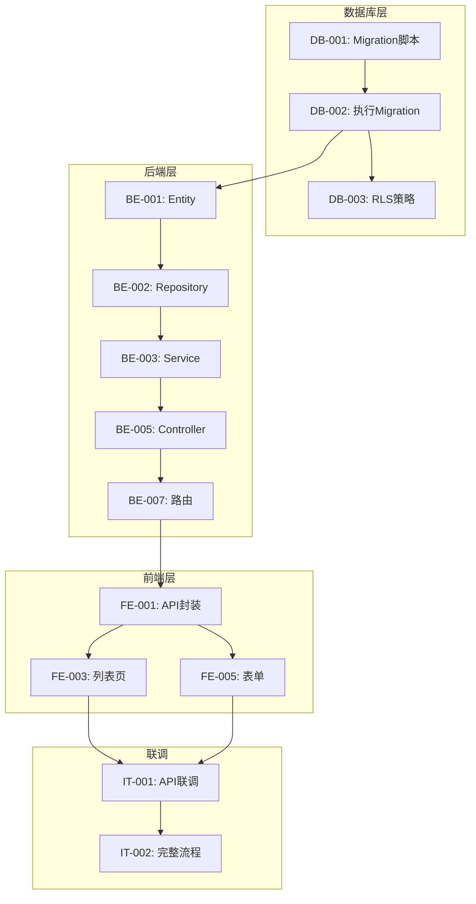

# DEV_PLAN_TEMPLATE.md
# 开发计划文档模板

---

> **使用说明**
> 1. 复制此模板到功能目录，重命名为 `20_DEV_PLAN.md`
> 2. 基于 DESIGN_FINAL.md 拆解任务
> 3. 每个任务应可在 1-4 小时内完成
> 4. 删除本使用说明块

---

# 20_DEV_PLAN.md
# {功能名称} - 开发计划

> 版本：v1.0
> 最后更新：{YYYY-MM-DD}
> 状态：{Draft | In Progress | Completed}
> 负责人：{@username}
> 关联文档：`10_DESIGN_FINAL.md`

---

## 1. 概述

### 1.1 开发目标

{本阶段要完成的开发目标}

### 1.2 范围边界

**本期包含：**
- {功能点 1}
- {功能点 2}

**本期不包含：**
- {延期功能}

### 1.3 前置条件

| 条件 | 状态 | 备注 |
|------|------|------|
| DESIGN_FINAL.md 已批准 | {待确认 / 已确认} | |
| 数据库访问权限 | {待确认 / 已确认} | |
| API 认证机制 | {待确认 / 已确认} | |

---

## 2. 任务分解

### 2.1 任务总览

| 阶段 | 任务数 | 预计工时 |
|------|--------|----------|
| 数据库层 | {n} | {m}h |
| 后端层 | {n} | {m}h |
| 前端层 | {n} | {m}h |
| 联调测试 | {n} | {m}h |
| **合计** | **{total}** | **{total}h** |

### 2.2 数据库层任务

| ID | 任务 | 优先级 | 依赖 | 验证方式 |
|----|------|--------|------|----------|
| DB-001 | 创建 Migration 脚本 | P0 | - | Migration 执行成功 |
| DB-002 | 执行 Migration | P0 | DB-001 | 表结构验证 |
| DB-003 | 添加 RLS 策略 | P0 | DB-002 | 权限测试 |
| DB-004 | 添加索引 | P1 | DB-002 | 查询性能验证 |

### 2.3 后端层任务

| ID | 任务 | 优先级 | 依赖 | 验证方式 |
|----|------|--------|------|----------|
| BE-001 | Entity 定义 | P0 | DB-002 | 类型正确 |
| BE-002 | Repository 实现 | P0 | BE-001 | 单元测试 |
| BE-003 | Service 实现 - CRUD | P0 | BE-002 | 单元测试 |
| BE-004 | Service 实现 - 业务逻辑 | P0 | BE-003 | 单元测试 |
| BE-005 | Controller 实现 | P0 | BE-004 | API 测试 |
| BE-006 | DTO 验证 | P0 | BE-005 | 验证测试 |
| BE-007 | 路由配置 | P0 | BE-005 | 路由可访问 |
| BE-008 | 错误处理 | P1 | BE-005 | 错误响应正确 |
| BE-009 | 权限控制 | P1 | BE-005 | 权限测试 |

### 2.4 前端层任务

| ID | 任务 | 优先级 | 依赖 | 验证方式 |
|----|------|--------|------|----------|
| FE-001 | API 封装 | P0 | BE-007 | 类型正确 |
| FE-002 | 路由配置 | P0 | - | 页面可访问 |
| FE-003 | 列表页实现 | P0 | FE-001, FE-002 | 功能验证 |
| FE-004 | 详情页实现 | P0 | FE-001, FE-002 | 功能验证 |
| FE-005 | 表单弹窗实现 | P0 | FE-001 | 功能验证 |
| FE-006 | 状态管理（如需要）| P1 | FE-001 | 状态正确 |
| FE-007 | 加载/空/错误状态 | P1 | FE-003 | UI 验证 |
| FE-008 | 表单验证 | P1 | FE-005 | 验证测试 |

### 2.5 联调测试任务

| ID | 任务 | 优先级 | 依赖 | 验证方式 |
|----|------|--------|------|----------|
| IT-001 | API 联调 | P0 | BE-007, FE-001 | 接口正常 |
| IT-002 | 完整流程测试 | P0 | FE-003~008 | 场景通过 |
| IT-003 | 边界条件测试 | P1 | IT-002 | 边界处理正确 |
| IT-004 | 性能测试 | P2 | IT-002 | 响应时间达标 |

---

## 3. 依赖关系

### 3.1 任务依赖图



### 3.2 关键路径

```
DB-001 → DB-002 → BE-001 → BE-002 → BE-003 → BE-005 → BE-007 → FE-001 → FE-003 → IT-001 → IT-002
```

---

## 4. 执行计划

### 4.1 里程碑

| 里程碑 | 完成标志 | 计划日期 |
|--------|----------|----------|
| M1: 数据库就绪 | DB 任务全部完成 | - |
| M2: 后端就绪 | API 可调用 | - |
| M3: 前端就绪 | 页面可操作 | - |
| M4: 功能完成 | 联调测试通过 | - |

### 4.2 执行顺序建议

```
Day 1:
  - DB-001: 创建 Migration 脚本
  - DB-002: 执行 Migration
  - DB-003: 添加 RLS 策略

Day 2:
  - BE-001: Entity 定义
  - BE-002: Repository 实现
  - BE-003: Service 实现 - CRUD

Day 3:
  - BE-004: Service 实现 - 业务逻辑
  - BE-005: Controller 实现
  - BE-006: DTO 验证
  - BE-007: 路由配置

Day 4:
  - FE-001: API 封装
  - FE-002: 路由配置
  - FE-003: 列表页实现

Day 5:
  - FE-004: 详情页实现
  - FE-005: 表单弹窗实现
  - FE-007: 状态处理
  - FE-008: 表单验证

Day 6:
  - IT-001: API 联调
  - IT-002: 完整流程测试
  - IT-003: 边界条件测试
  - Bug 修复
```

---

## 5. 风险与应对

### 5.1 风险识别

| 风险 | 可能性 | 影响 | 应对措施 |
|------|--------|------|----------|
| API 设计变更 | 中 | 高 | 前后端同步更新 SPEC |
| 数据库权限问题 | 低 | 高 | 提前申请权限 |
| 组件兼容性 | 低 | 中 | 使用 Element Plus 标准组件 |

### 5.2 阻塞处理

当遇到阻塞时：
1. 记录阻塞原因到 PROGRESS_LOG
2. 通知相关人员
3. 切换到非阻塞任务
4. 阻塞解除后继续

---

## 6. 验收标准

### 6.1 功能验收

- [ ] 列表查询：分页、搜索、筛选正常
- [ ] 新增：表单验证、提交成功、列表刷新
- [ ] 编辑：数据回显、修改成功、列表刷新
- [ ] 删除：确认提示、删除成功、列表刷新
- [ ] 详情：数据展示正确

### 6.2 非功能验收

- [ ] 性能：列表接口 < 200ms
- [ ] 安全：权限控制生效
- [ ] 体验：加载/空/错误状态正确
- [ ] 兼容：Chrome/Firefox/Safari 正常

### 6.3 代码质量

- [ ] 遵循项目代码规范
- [ ] 无 ESLint 错误
- [ ] 关键逻辑有单元测试
- [ ] 无硬编码敏感信息

---

## 7. Claude Code 执行指南

### 7.1 开始开发时

```markdown
1. 读取本文档了解任务清单
2. 按依赖顺序执行任务
3. 每完成一个任务：
   - 验证完成
   - 更新 PROGRESS_LOG 状态
   - 提交代码（如有）
4. 遇到问题时记录并处理
```

### 7.2 任务状态更新

```yaml
# 更新 PROGRESS_LOG.yaml
- id: BE-001
  task: "Entity 定义"
  status: done              # pending → wip → done
  completed_at: 2024-12-10
  notes: "完成 Resource.entity.ts"
```

### 7.3 每日结束时

```markdown
1. 更新所有任务状态
2. 记录未完成任务的进度
3. 生成 DAILY_SUMMARY
4. 更新 cc_checkpoint
5. 提交代码
```

---

## 8. 进度跟踪

### 8.1 任务统计

| 层 | 总数 | 完成 | 进行中 | 待开始 | 完成率 |
|----|------|------|--------|--------|--------|
| 数据库 | 4 | 0 | 0 | 4 | 0% |
| 后端 | 9 | 0 | 0 | 9 | 0% |
| 前端 | 8 | 0 | 0 | 8 | 0% |
| 联调 | 4 | 0 | 0 | 4 | 0% |
| **合计** | **25** | **0** | **0** | **25** | **0%** |

### 8.2 变更记录

| 日期 | 变更 | 原因 | 影响 |
|------|------|------|------|
| - | - | - | - |

---

## CHANGELOG

| 版本 | 日期 | 作者 | 变更内容 |
|------|------|------|----------|
| v1.0 | {日期} | {作者} | 初始版本 |
